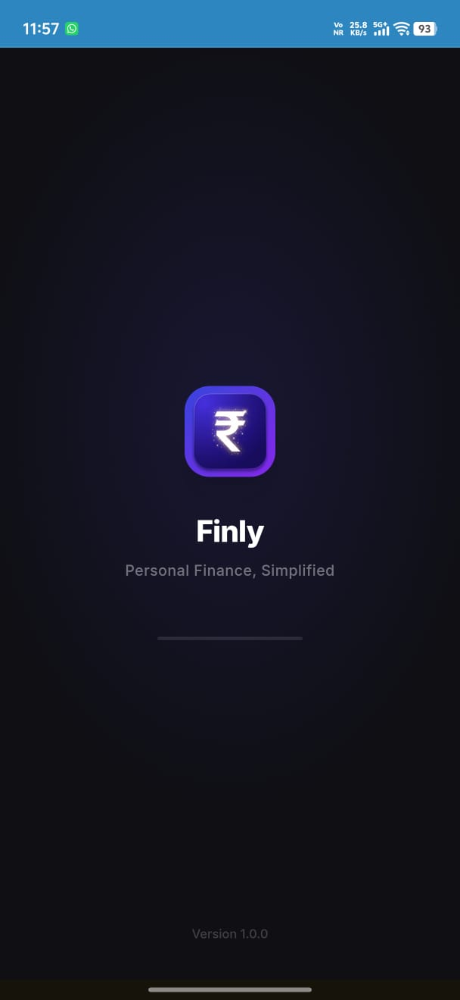
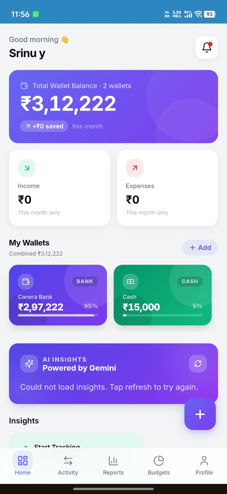
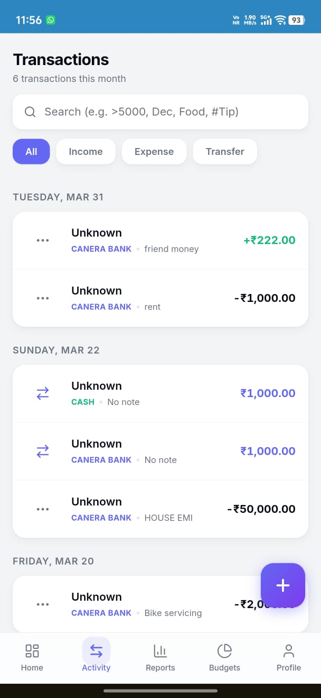
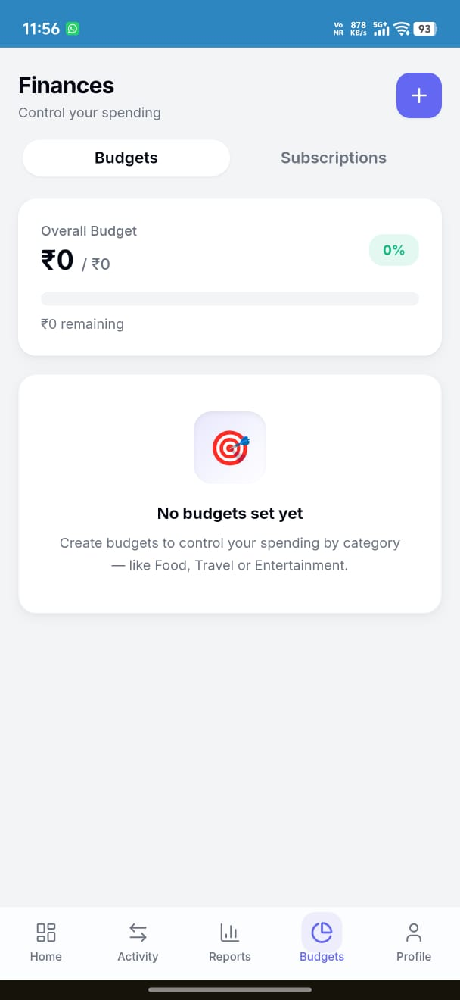
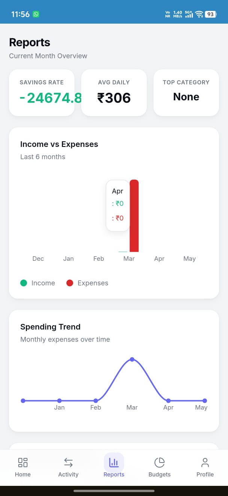
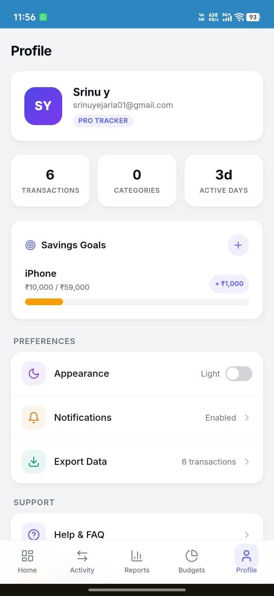

<div align="center">
  
  <h1>Finly — Personal Finance Tracker 💰</h1>
</div>


A modern, mobile-first personal finance and budget tracking app built for India. Track your income, expenses, and multiple wallets all in one place.

---

## 📸 Screenshots

<div align="center">
  
  
  
</div>
<div align="center">
  
  
  
</div>

---

## 🚀 Tech Stack

| Layer | Technology |
|---|---|
| **Frontend** | React 18 + TypeScript + Vite |
| **Styling** | Tailwind CSS + Custom Design System |
| **Animations** | Framer Motion |
| **State Management** | Zustand |
| **Backend / Database** | Supabase (PostgreSQL + Auth + Storage) |
| **Icons** | Lucide React |
| **Charts** | Recharts |
| **PWA** | Vite PWA Plugin |

---

## ✨ Features

### Core
- **Multi-Wallet Support** — Bank, Cash, Credit Card, and E-Wallet accounts
- **Wallet Transfers** — Move money between accounts without affecting expense analytics
- **Income & Expense Tracking** — Log transactions with categories, notes, and wallet association
- **Budget Management** — Set monthly spending limits per category with real-time progress
- **Recurring Subscriptions** — Track fixed monthly bills like Netflix, Rent, and Spotify

### Analytics & Insights
- **Reports Dashboard** — 6-month trend charts, category breakdowns, MoM comparisons
- **#Hashtag Analytics** — Tag notes with `#GoaTrip` or `#Amazon` for custom spending reports
- **Savings Goals** — Set financial goals with progress tracking and manual contributions

### UX & Polish
- **Receipt Photo Uploads** — Attach images to transactions via Supabase Storage
- **Advanced Search & Filters** — Search by name, month, or amount range (`>5000`, `<500`, `Dec`)
- **CSV Export** — Download all transactions as a spreadsheet
- **Illustrated Empty States** — Friendly onboarding cues throughout the app
- **India-first** — ₹ currency, Indian number formatting, local conventions
- **Splash Screen + Onboarding** — Premium first-time experience
- **PWA Ready** — Installable on Android / iOS home screen

---

## 🛠️ Getting Started

### Prerequisites
- Node.js 18+
- A [Supabase](https://supabase.com) project

### 1. Clone & Install

```bash
git clone <your-repo-url>
cd budget-buddy-main
npm install
```

### 2. Configure Environment

Create a `.env.local` file in the root of the project:

```env
VITE_SUPABASE_URL=your_supabase_project_url
VITE_SUPABASE_ANON_KEY=your_supabase_anon_key
```

### 3. Run Locally

```bash
npm run dev
```

Open [http://localhost:8080](http://localhost:8080) in your browser.

---

## 🗄️ Database Schema

The app uses the following Supabase tables (all protected with Row-Level Security):

| Table | Purpose |
|---|---|
| `profiles` | User profile data |
| `wallets` | User wallets (Bank, Cash, Credit, E-Wallet) |
| `categories` | Transaction categories with icons and colors |
| `transactions` | All financial entries (income, expense, transfer) |
| `budgets` | Monthly spending limits per category |
| `subscriptions` | Recurring expense tracking |
| `goals` | Savings goals with progress |

> **Storage Bucket:** `receipts` — for transaction photo attachments.

---

## 📁 Project Structure

```
src/
├── components/       # Reusable UI components
│   ├── WalletList.tsx
│   ├── QuickAddSheet.tsx
│   ├── TransactionCard.tsx
│   ├── SubscriptionsList.tsx
│   ├── GoalsList.tsx
│   └── ...
├── pages/            # Route-level page components
│   ├── Dashboard.tsx
│   ├── Transactions.tsx
│   ├── Budgets.tsx
│   ├── Reports.tsx
│   └── Profile.tsx
├── store/            # Zustand global state
│   ├── useDataStore.ts
│   └── useAuthStore.ts
└── lib/
    └── supabase.ts   # Supabase client
```

---

## 🩺 Troubleshooting

### App stuck on the splash / "Loading…" screen

Almost always the Supabase backend is unreachable. Check the browser console:

| Symptom | Cause | Fix |
| --- | --- | --- |
| `ERR_NAME_NOT_RESOLVED` on `<ref>.supabase.co` | **Project is paused.** Free-tier projects auto-pause after ~7 days of inactivity, and Supabase withdraws the DNS record while paused — so nothing resolves. | Supabase dashboard → the project → **Resume project**, wait ~2 min, reload. |
| HTTP `540` | Project is paused/restoring but DNS is back | Wait for the restore to finish. |
| `Failed to fetch` with no hostname error | Offline, or wrong `VITE_SUPABASE_URL` | Verify `.env.local`, restart `npm run dev` (Vite only reads env at boot). |

Verify from the CLI:

```bash
nslookup your-project-ref.supabase.co 8.8.8.8
```

`Non-existent domain` ⇒ the project is paused or deleted; no code change can work around it.

To avoid repeat pauses on the free plan, hit the project at least weekly (a scheduled
`GET /auth/v1/health` from a cron job is enough) or upgrade to Pro.

### How the app behaves when the backend is down

The client is hardened so an unreachable backend never produces a hung UI:

- every request has a **20 s timeout**; reads (`GET`/`HEAD`) retry twice with exponential backoff, so brief blips and cold starts recover on their own. Writes are **not** retried — a replayed `POST` could duplicate a transaction.
- retryable conditions include `503` (restarting) and `404 PGRST205` (PostgREST schema cache still cold), which is exactly what a just-resumed project returns for its first minute.
- auth bootstrap has a **12 s ceiling** and the splash screen a **6 s ceiling**, so `loading` always resolves.
- on failure the app probes `/auth/v1/health` and shows a real diagnosis plus a **Retry** button (`BackendErrorScreen`) instead of a spinner.
- unusable cached tokens are cleared so you land on the login screen rather than a refresh loop.

---

## 🔌 Request pooling & keep-alive

### Keeping the project awake

Two layers, because each covers what the other can't:

| Layer | File | Covers |
| --- | --- | --- |
| In-app keep-alive | `src/lib/keepAlive.ts` | Pings `/auth/v1/health` every 10 min **while the app is open** |
| Scheduled workflow | `.github/workflows/supabase-keepalive.yml` | Pings auth **and** the database twice weekly, **even with nobody using the app** |

The workflow is the one that actually prevents pauses during a quiet week. Enable it once:

```bash
gh secret set SUPABASE_URL --body "https://your-project-ref.supabase.co"
gh secret set SUPABASE_ANON_KEY --body "your-anon-key"
gh workflow run "Supabase keep-alive"
```

### No duplicate workers ("zombies")

Every mechanism here is single-instance by construction:

- **One Supabase client per page.** `createClient` is cached on `globalThis`, so Vite HMR and React StrictMode can't accumulate GoTrue clients. Duplicates each run their own token-refresh timer against the same session, and a losing race can overwrite good tokens with a stale rotation — silently logging the user out. (This is what the *"Multiple GoTrueClient instances detected"* warning means.)
- **One pinger per browser, not per tab.** A `localStorage` lease (90 s TTL, renewed every 30 s) elects a single leader tab. Other tabs stay idle; if the leader closes or crashes, another claims the expired lease within ~30 s, so the job is never orphaned. `startKeepAlive()` is idempotent — it tears down any previous instance first.
- **No overlapping pings.** An in-flight flag makes a tick a no-op while one is pending.
- **No overlapping CI runs.** The workflow uses a `concurrency` group.
- **No double hydration.** Tab focus fires *both* `focus` and `visibilitychange`; a 30 s cooldown in `App.tsx` stops each tab switch from issuing 8 requests instead of 4.

### Client-side pooling (`src/lib/requestPool.ts`)

`supabase-js` will happily fire unbounded parallel requests. Two primitives bound that:

- **`ConcurrencyLimiter`** — at most **6** requests in flight; the rest queue. Keeps a hydration burst from starving interactive requests. Slots are *handed over* rather than released-then-reacquired, so a caller arriving mid-handoff can't over-admit.
- **`SingleFlight`** — concurrent identical reads (same method + URL + auth token) collapse into one network request. Callers each get their own `response.clone()`. Deliberately *not* bound to any one caller's `AbortSignal`: one component unmounting must not cancel a request its siblings are awaiting, so each caller races its own signal instead.

Measured in the browser: **20 concurrent reads → 10 network requests, peak concurrency exactly 6.**
In dev, inspect live state with `window.__finlyPool()`. Covered by `src/test/requestPool.test.ts`.

### Server-side pooling (Supavisor)

Genuine *connection* pooling only applies to direct Postgres connections — migrations,
scripts, server jobs. Browser code never needs it. See the commented connection strings at
the bottom of `.env.example`:

- **port 6543 — transaction mode:** pooled via Supavisor, for serverless/short-lived clients. No prepared statements, no `LISTEN`/`NOTIFY`.
- **port 5432 — session mode:** a dedicated backend per client; use for migrations and long-lived processes.

---

## 📄 License

This project is for educational and personal use.
